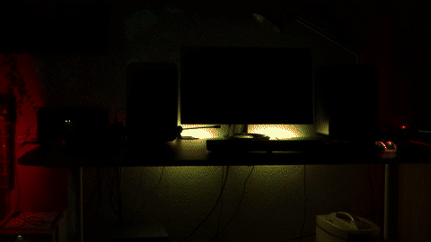

# Beat Detector - Audio Beat Detection Library Written In Rust

beat-detector detects beats in live audio, but can also be used for post
analysis of audio data. It is a library written in Rust that is
`no_std`-compatible and doesn't need `alloc`.

beat-detector was developed with typical sampling rates and bit depths in
mind, namely 44.1 kHz, 48.0 kHz, and 16 bit. Other input sources might work
as well.

# Performance / Latency
On a realistic workload each analysis step of my algorithm, i.e., on each new audio input, took 0.5ms on a Raspberry
Pi and 0.05ms on an Intel i5-10600K. The benchmark binary was build as optimized release build. Thus, this is the
minimum latency you have to expect plus additional latency from the audio input interface.
The benchmark can be executed with: `cargo run --release --example --bench`

TODO: performance/latency over memory usage. Thus higher memory usage and more buffers for maximum performance

---

This is a Rust library that enables beat detection on live audio data input.
One use case is that you have an audio/aux-splitter on your computer where one
end goes into the sound system whereas the other goes into the microphone input
of a Raspberry Pi.

TODO outdated

The crate provides multiple strategies that you can connect to the audio source.
So far it offers two strategies:
- **Simple Lowpass Filter**
  - not really good, must be more fine-tuned
- **Simple Spectrum Analysis**
  - good enough for most "simple" songs, like 90s pop hits or "Kids" by "MGMT"
- Super Awesome Analysis (TODO) - **CODE CONTRIBUTIONS ARE WELCOME**

I'm not an expert in audio analysis, but I'm proud what I achieved so far with the spectrum strategy.
This library needs a more "bulletproof" strategy, to cope with complex and fast songs.

Here's a demo I recorded in my room. Of course, it was synced to music, when I recorded it. :)



## How To Use
**Cargo.toml**
```toml
beat-detector = "<latest version>"
```

**code.rs**
(also see `examples/` in repository!)
```rust
//! Minimum example on how to use this library. Sets up the "callback loop".

use cpal::Device;
use beat_detector::StrategyKind;
use std::sync::atomic::{AtomicBool, Ordering};
use std::sync::Arc;

/// Minimum example on how to use this library. Sets up the "callback loop".
fn main() {
    let recording = Arc::new(AtomicBool::new(true));

    let recording_cpy = recording.clone();
    ctrlc::set_handler(move || {
        eprintln!("Stopping recording");
        recording_cpy.store(false, Ordering::SeqCst);
    }).unwrap();

    let dev = select_input_device();
    let strategy = select_strategy();
    let on_beat = |info| {
        println!("Found beat at {:?}ms", info);
    };
    // actually start listening in thread
    let handle = beat_detector::record::start_listening(
        on_beat,
        Some(dev),
        strategy,
        recording,
    ).unwrap();

    handle.join().unwrap();
}

fn select_input_device() -> Device {
    // todo implement user selection
    beat_detector::record::audio_input_device_list().into_iter().next().expect("At least one audio input device must be available.").1
}

fn select_strategy() -> StrategyKind {
    // todo implement user selection
    StrategyKind::Spectrum
}
```

## MSRV (Minimal Supported Rust Version)

1.76 stable
