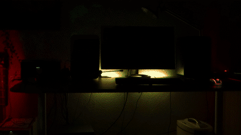

# beat-detector

Beat detection for live audio and recordings, written in Rust. The library
is `no_std`, doesn't allocate, and keeps less than 1 KiB of state.

- **Low latency**: beats are reported ~2 ms after their onset.
- **Cheap**: ~1-2 ns per sample, i.e., well below 1 us per live audio
  buffer on a laptop CPU.
- **Simple**: one small, documented algorithm without audio history.

A typical setup: an audio splitter feeds the music both into the speakers
and into the line input of a Raspberry Pi, which flashes lights on each
beat.



## Usage

```toml
[dependencies]
beat-detector = "<latest version>"
```

**Live audio**: pass each buffer of the audio input to the detector. It
expects mono `f32` samples in range `-1.0..=1.0`.

```rust
use beat_detector::BeatDetector;

let mut detector = BeatDetector::new(44100.0);
// In the callback of your audio input:
if let Some(beat) = detector.process(&buffer) {
    println!("beat at {:?}", beat.time);
}
```

With the `recording` feature (default), `recording::start_detector_thread()`
does this for the audio input of the system, using [cpal].

**Recordings**: get all beats of a file with timestamps from its beginning:

```rust
for beat in beat_detector::detect_all(&samples, 44100.0) {
    println!("beat at {:?}", beat.time);
}
```

## How It Works

The detector reports sudden rises in the level of the bass, i.e., kick
drums. For each block of 64 samples, it

1. filters the bass (20-120 Hz),
2. follows its level with an envelope,
3. compares how much the envelope rose within ~6 ms against the background
   level of the last ~200 ms and against the strength of the recent beats.

It adapts to the input volume. The defaults favor missed beats over false
positives. See the documentation of `BeatDetector` for details and `Config`
for tuning.

Known limitations:

- It detects kicks, not the beat of music without them.
- After a sudden, large volume drop, the first quieter beat is missed: in the
  tests, a drop of 10 dB is fine, a drop of 18 dB is not.
- The first bass note after silence is reported as a beat. So is the start
  of a recording that begins in the middle of a song.

## Checking and Debugging

**Real music**: detect the beats of a local WAV file and compare them with
the waveform:

```sh
cargo run --release --example analyze-wav -- song.wav
```

It prints all beats and the processing cost, and writes `song.beats.txt`.
Import it in [Audacity] with "File > Import > Labels..." to see each beat as
a marker on the waveform.

**Live input**: `cargo run --release --example live-input-minimal` prints
each beat. With `RUST_LOG=trace`, it also logs the processing time of each
audio buffer. `live-input-visualize` flashes a window on each beat.

**Tests** use synthetic signals with exactly known beats: kicks, hi-hats,
snares, bass notes, noise, and DC offset, each at different volumes. For
each beat, the evaluation shows the latency from its onset in the input to
its detection. When a test fails, it prints a table of all onsets and
detections, a text view of the signal, and writes a PNG of it to
`target/test-artifacts/`:

```text
     onset    detected     latency
  500.0 ms    502.1 ms      2.1 ms
         -    774.9 ms  FALSE POSITIVE
 1000.0 ms   1001.3 ms      1.3 ms
...
```

**Performance**: `cargo bench` measures the cost per sample and per live
audio buffer.

## Features

- `recording` (default): beat detection on the audio input of the system.
  Requires `std`.
- `simd`: explicit SIMD implementation of the filters. Requires Rust 1.89.

## MSRV

The MSRV of the library is 1.88, or 1.89 with the `simd` feature.

[Audacity]: https://www.audacityteam.org/
[cpal]: https://crates.io/crates/cpal
